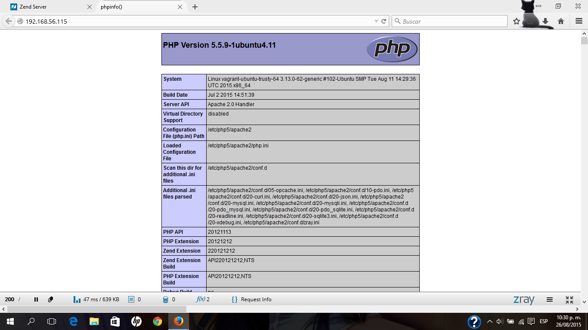

## Vagrant - Ubuntu Server 14.04

Esta el la difinición del archivo vagrant para generar un servidor LAMP con Ubuntu Server 14.04 y MySQL 5.5, además de PHP 5.5

#### Valores por defecto:

Para el equipo:
* Usuario: vagrant
* Password: vagrant

Para MySQL
* Usuario: root
* Password: root

Red privada HostOnly: 192.158.56.115

También se puede habilitar los puertos (aproximadamente linea 26) si no existe un servidor activo en el sistema solo hay que agragar:

```ruby
# Web Server
config.vm.network "forwarded_port", guest: 80, host: 80
# MySQL
config.vm.network "forwarded_port", guest: 3306, host: 3306
```

Podran ver lo que ejecuten en el servidor en: http://localhost/

### Z-Ray
Es una herramienta para desarrollo que proporsiona información detallada de lo que se ha ejecutado.
Para accesar a z-ray: http://192.168.56.115:10081

```ruby
# Z-Ray
config.vm.network "forwarded_port", guest: 10081, host: 10081
```
Para usar localhost: http://localhost:10081

